# AviUtl2 IntelliSense

VSCodeでAviUtl2のスクリプト(`.anm2` / `.obj2` / `.cam2` / `.scn2` / `.tra2`)を書くための拡張機能です。
構文ハイライト・補完・引数ヒント・診断などで、スクリプトの作成を補助します。

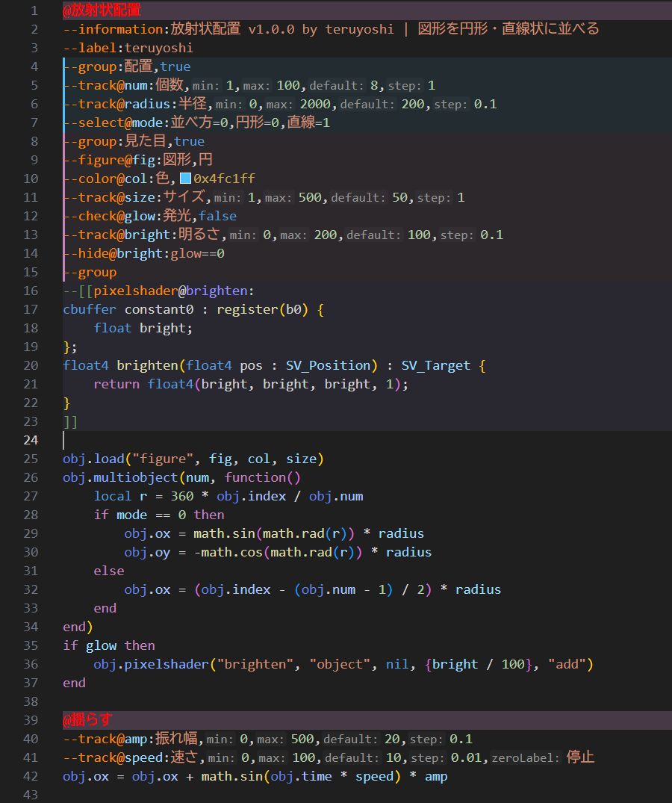

[seilor0さんのAviUtl2-IntelliSense-Fork](https://github.com/seilor0/AviUtl2-IntelliSense-Fork)
(元は[hirokawa-beachさんのAviUtl2-IntelliSense](https://github.com/hirokawa-beach/AviUtl2-IntelliSense))が
AviUtl2 beta20時点で更新停止していたため、AviUtl2 **ver 2.1.10(lua.txt 2026/9/19版)** の仕様を元に作り直したものです。

## 導入方法

1. [Releases](https://github.com/teruyoshii/AviUtl2-IntelliSense/releases/latest) から `aviutl2-intellisense-x.x.x.vsix` をダウンロードします。
2. VSCodeの拡張機能メニュー右上の「…」→「VSIXからのインストール」でダウンロードしたファイルを選択します。
   (コマンドの場合は `code --install-extension aviutl2-intellisense-x.x.x.vsix`)

更新する場合も、新しいvsixで同じ手順を行ってください。

> [!IMPORTANT]
> AviUtl2 IntelliSense Fork(または元のAviUtl2 IntelliSense)を導入している場合は、先にアンインストールしてください。
> フォーク版はLua全体の文法を置き換えるため、併用すると色分けが崩れます。

## 機能

`@` で区切った複数スクリプトのファイルでは、変数・シェーダーの補完や診断はスクリプト(セクション)ごとに扱います。

### 構文ハイライト

指示子(`--track@` など)・`@スクリプト名`・`obj.xxx`・独自関数・`global` などに色を付けます。
`--[[pixelshader@...]]` の中はHLSLとして色分けします。色は[設定画面](#設定画面)で要素ごとに変更できます(冒頭の画像を参照)。

### 補完

`obj.` の後にobj変数・obj関数の候補を表示します。候補を選ぶと右側に説明が表示されます。

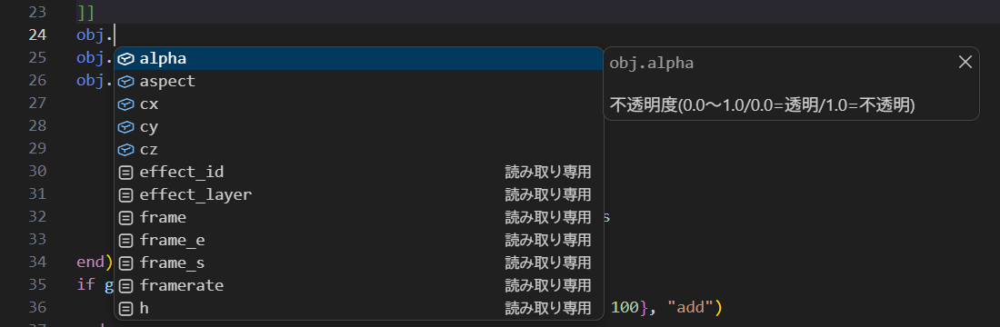

行頭で `--` と入力すると指示子の候補を表示します。選ぶと `--track@変数名:項目名,最小値,最大値,デフォルト値` のような雛形が入力されます。

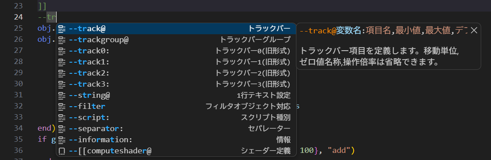

このほか、`math.` `string.` `table.` などのLua標準ライブラリ、独自関数(`RGB()` など)、指示子で定義した変数も補完できます。

### 引数の候補

`obj.load("…")` `obj.setoption("…")` `obj.getoption("…")` `obj.getinfo("…")` などの文字列引数の候補を表示します。

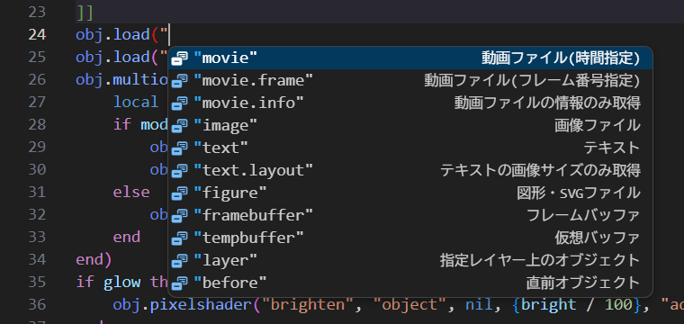

第1引数に応じて第2引数の候補が変わります。例えば `obj.setoption("blend", …)` では合成モードの候補になります。

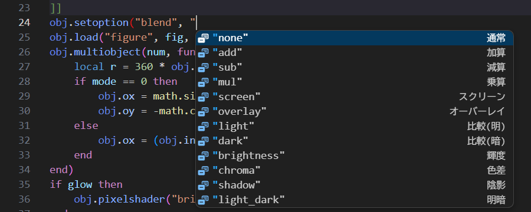

`obj.pixelshader("…")` にはファイル内で定義したシェーダー名を、`obj.data("…")` には `--data@` の登録名を、`obj.getvalue("track.…")` にはトラックバーの変数名を候補に出します。

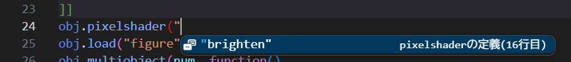

### 引数ヒント

関数の引数を入力中に、各引数の説明を表示します。`obj.load("text", …)` のように、第1引数に応じて形式ごとの説明に切り替わります。指示子の行でも、今入力している項目の説明を表示します。

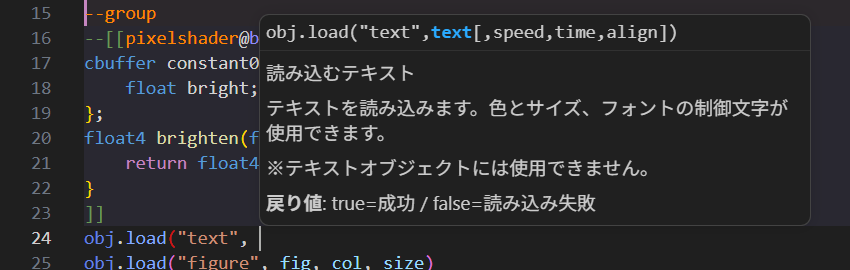

### ホバー

関数・変数・指示子・文字列引数にマウスを乗せると説明を表示します。

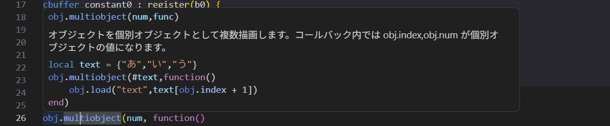

指示子で定義した変数では、項目名・範囲・初期値・定義行を表示します。

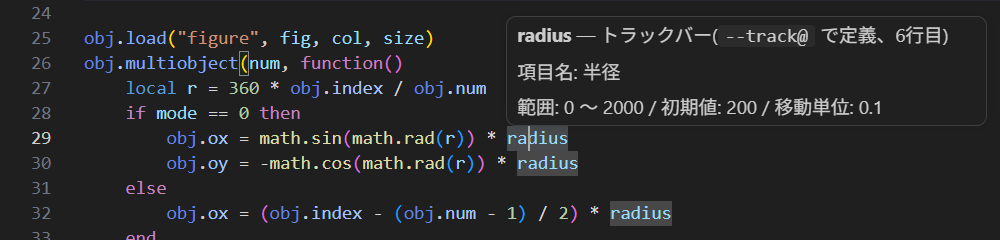

### 定義へ移動

変数から `--track@` などの定義行へ、`obj.pixelshader("brighten", …)` の `"brighten"` からシェーダーの定義へ、`"track.xxx"` からトラックバーの定義へ移動できます(F12 / Alt+F12 でその場に表示)。

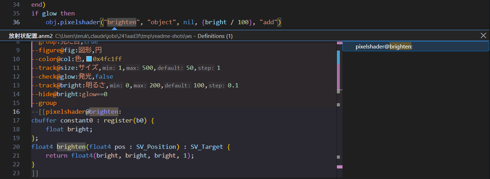

### アウトライン

エクスプローラーの「アウトライン」やパンくずリストに、`@スクリプト` > `--group` > 設定項目・シェーダー定義 の階層を表示します。

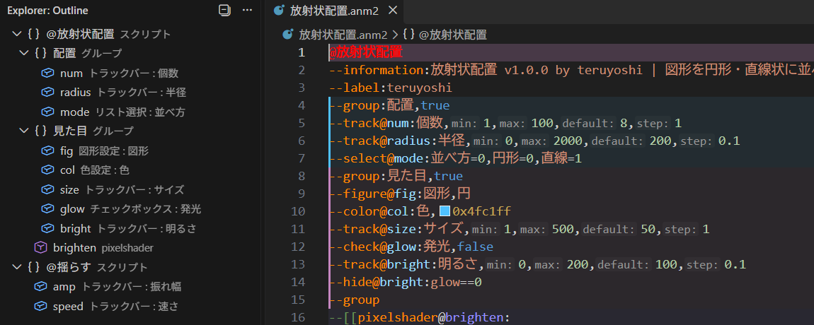

### 色見本

`0xRRGGBB` の横に色見本を表示します。見本にマウスを乗せるとカラーピッカーで色を編集できます。

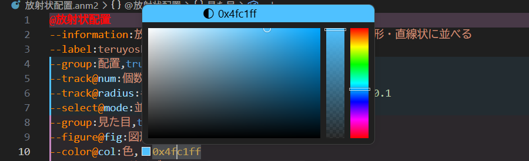

### 設定グループの範囲表示

`--group` で作った設定グループの範囲に、色付きの線と薄い背景を付けます。グループごとに色が変わります。

設定で、開始行に「▼ グループ名 N項目」、終了行に「▲ ここまで」も表示できます(下の画像は表示をオンにした状態)。

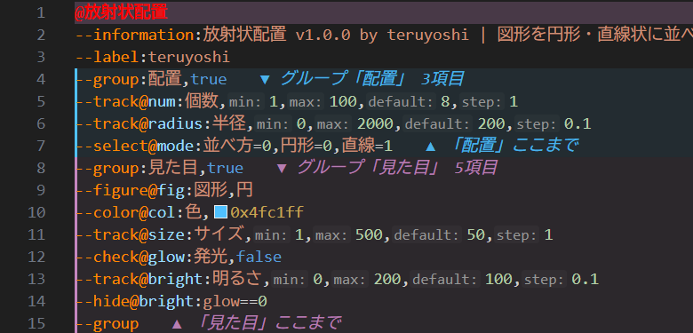

### @スクリプト名の強調

`@スクリプト名` の行全体に背景色を付け、スクロールバーの横にも印を表示します。長いファイルでもスクリプトの区切りが一目で分かります。

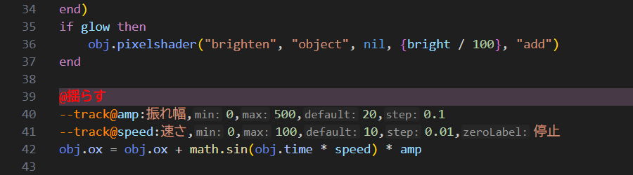

### シェーダー定義の強調

`--[[pixelshader@` ～ `]]`(computeshader も同様)の範囲に背景色を付けます。

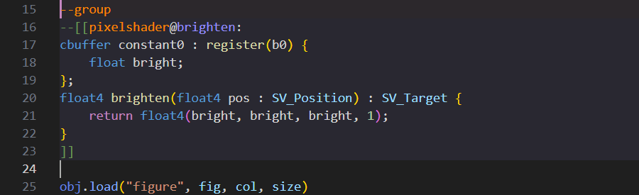

### --track@ の補助表示

`--track@` の各値の前に `min:` `max:` `default:` `step:` などの項目名を小さく表示します。項目ごとのオン/オフと表示色を設定できます。

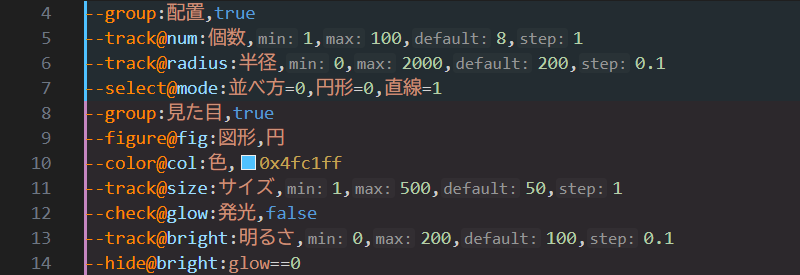

### 折りたたみ

設定グループ・`@スクリプト`・シェーダー定義を折りたためます。インデントによる折りたたみもそのまま使えます。

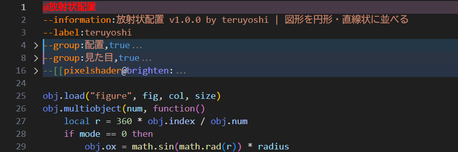

### 診断

書き間違いなどを波線と「問題」パネルで知らせます。主に次のものを検出します。

- 指示子のタイプミス(`--infomation` など)
- トラックバーの引数不足・範囲外の初期値
- 変数名・項目名の重複
- `--trackgroup` / `--hide` の未定義の変数
- 未定義のシェーダー名・`--data` 名
- `.tra2` 専用の指示子の誤用

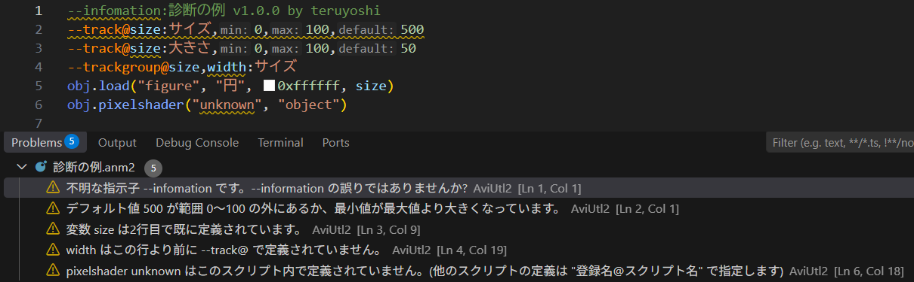

### 設定画面

コマンドパレット(Ctrl+Shift+P)で「AviUtl2 IntelliSense: 設定」を実行すると、次の設定をまとめて変更できる画面が開きます。変更はすぐにエディタへ反映されます。

- 要素ごとの文字色・太字・斜体・下線
- `--track@` の補助表示のオン/オフと色
- `@スクリプト名` の行・シェーダー定義の背景色と濃さ
- 設定グループの範囲表示の色と濃さ

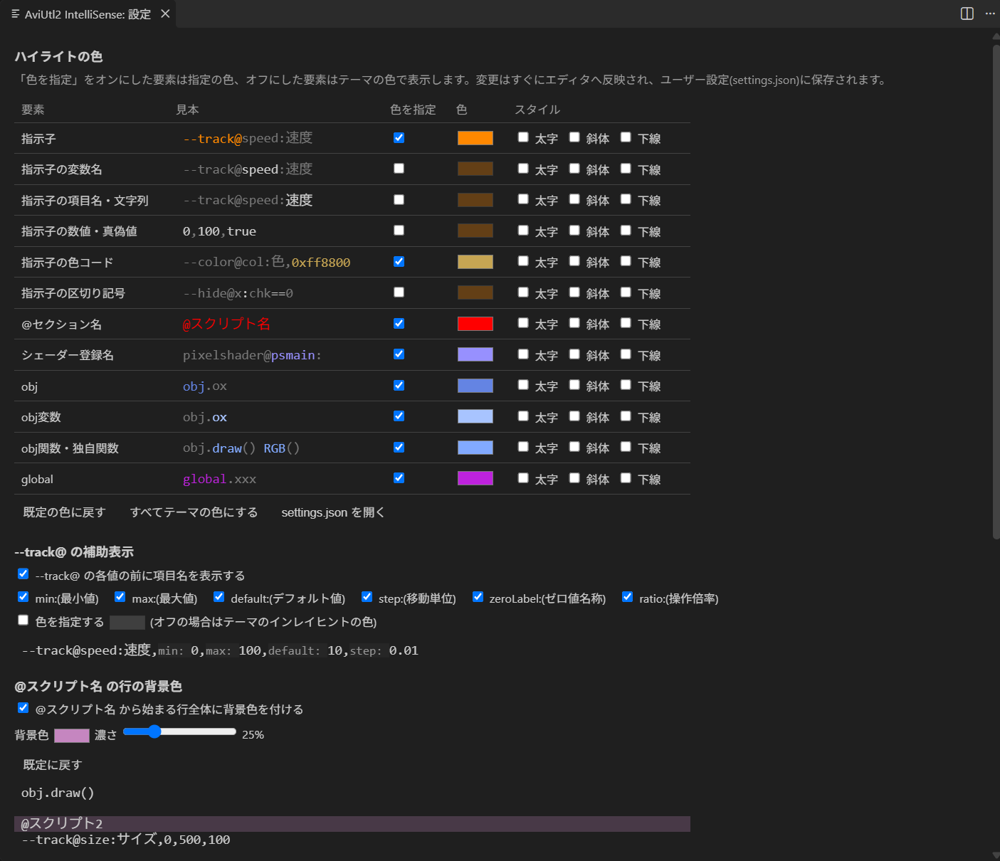

### フォーク版からの主な変更点

- **設定の追加が不要**: VSCode標準のLua文法を置き換えず、AviUtl2固有の要素だけを上乗せ(インジェクション)する方式に変更し、テーマで自動的に色が付く標準的なスコープ名を使うようにしました。
  以前の `editor.tokenColorCustomizations`(`aul2.settings.lua` / `aul2.type.lua`)の設定もそのまま効きます。
- **最新仕様に対応**: beta21以降に追加された以下などに対応しました。
  - 指示子: `--trackgroup@` `--checksection@` `--folder@` `--string@` `--hide@` `--group` `--separator` `--filter` `--require` `--hidemenu`、`--track@` のゼロ値名称・操作倍率、tra2の `--param` の `/check` `/select`
  - 変数: `obj.frame_s` `obj.frame_e` `obj.effect_layer` `obj.originframe` `global`
  - 関数: `obj.getfont()` `obj.multiobject()` `print()`、`obj.getvalue(effect,item)` / `obj.getvalue(layer,effect,item)`、`obj.clearbuffer(target,w,h)`、`obj.load("movie.frame" / "movie.info" / "text.layout")`、`obj.setfont()` の太文字〜行間隔、`obj.load("text")` の文字揃え、`obj.load("figure")` のアスペクト比
  - オプション: `obj.getoption()` の `group_info` `enable_group` `clipping_object` など、`obj.setoption("camera_focus")`、`"rgba_add"` `"force"` `"no_resize"`、`obj.setanchor()` の `mesh` `rgba` `offset` `screen` `small`、`obj.getinfo()` の `bpm_list` `frame_max` `layer_max`、`obj.getpoint()` の `default` `frame_s` など
- AviUtl2のスクリプトファイルのみを対象とし、通常の `.lua` ファイルでは補完・診断が動かないようにしました。
- ホバー表示・定義へ移動・色見本・診断などを追加しました。

## 設定

| 設定 | 既定値 | 内容 |
| --- | --- | --- |
| `aviutl2.diagnostics.enable` | `true` | 診断(問題パネルへの警告表示)を行うか |
| `aviutl2.colorDecorator` | `"all"` | 色見本を表示する範囲(`all`=全ての0xRRGGBB / `directive`=`--color` の行のみ / `off`) |
| `aviutl2.completion.luaStandardLibrary` | `true` | Luaの基本関数・ライブラリ名を補完候補に含めるか(Lua言語サーバーと併用する場合はオフ推奨) |
| `aviutl2.tokenColors` | 下記の既定色 | 要素毎の文字色(`#RRGGBB`)。`""` を指定した要素と既定色の無い要素はテーマの色 |
| `aviutl2.tokenFontStyles` | `{}` | 要素毎の文字スタイル(`bold` `italic` `underline` `strikethrough` を空白区切り) |
| `aviutl2.groupHighlight.enable` | `true` | 設定グループの範囲を表示するか |
| `aviutl2.groupHighlight.showLabels` | `false` | 開始・終了行に注記を表示するか |
| `aviutl2.groupHighlight.backgroundOpacity` | `0.08` | グループの背景色の濃さ(0〜1) |
| `aviutl2.groupHighlight.colors` | 6色 | グループの表示色(グループ毎に順番に使用) |
| `aviutl2.inlayHints.trackParameters` | `true` | `--track@` / `--track0:` の各値の前に `min:` `max:` `default:` `step:` `zeroLabel:` `ratio:` を表示するか(全体) |
| `aviutl2.inlayHints.track.min` / `.max` / `.default` / `.step` / `.zeroLabel` / `.ratio` | `true` | 上記の項目毎の表示のオン/オフ |
| `aviutl2.inlayHints.trackColor` | `""` | 上記の補助表示の文字色(`#RRGGBB`)。空欄の場合はテーマのインレイヒントの色 |
| `aviutl2.sectionHighlight.enable` | `true` | `@スクリプト名` の行全体に背景色を付けるか |
| `aviutl2.sectionHighlight.color` | `"#C586C0"` | `@スクリプト名` の行の背景色 |
| `aviutl2.sectionHighlight.opacity` | `0.25` | `@スクリプト名` の行の背景色の濃さ(0〜1) |
| `aviutl2.shaderHighlight.enable` | `true` | `--[[pixelshader@` ～ `]]`(computeshader も同様)の範囲に背景色を付けるか |
| `aviutl2.shaderHighlight.color` | `"#9790FE"` | シェーダー定義の範囲の背景色 |
| `aviutl2.shaderHighlight.opacity` | `0.08` | シェーダー定義の範囲の背景色の濃さ(0〜1) |

### 色の個別設定について

コマンドパレット(Ctrl+Shift+P)で「AviUtl2 IntelliSense: 設定」を実行すると設定画面が開きます。「色を指定」をオンにした要素は指定の色、オフにした要素はテーマの色になり、変更はすぐにエディタへ反映されます。「既定の色に戻す」で下記の既定色に、「すべてテーマの色にする」で全要素をテーマの色にできます。

既定色: 指示子 `#FF8800` / 指示子の色コード `#C6A553` / @セクション名 `#FF0000` / シェーダー登録名 `#9790FE` / obj `#6484E3` / obj変数 `#A8C4FF` / obj関数・独自関数 `#82AAFF` / global `#BE22DD`(その他の要素はテーマの色)

設定できる要素のキー(`aviutl2.tokenColors` / `aviutl2.tokenFontStyles` で使用):
`directive`(指示子) / `directiveVariable`(指示子の変数名) / `directiveText`(指示子の項目名・文字列) / `directiveValue`(指示子の数値・真偽値) / `directiveColor`(指示子の色コード 0xRRGGBB) / `directivePunctuation`(指示子の区切り記号) / `section`(@セクション名) / `shaderName`(シェーダー登録名) / `obj` / `objVariable`(obj変数) / `function`(obj関数・独自関数) / `global`

```json
"aviutl2.tokenColors": { "directive": "#FF8800", "objVariable": "#4FC1FF" },
"aviutl2.tokenFontStyles": { "directive": "bold" }
```

これらの値は、名前が `AviUtl2: ` で始まるルールとしてユーザー設定の `editor.tokenColorCustomizations` に自動で書き込まれます(自分で書いた他のルールはそのまま残ります)。
ワークスペース設定で `editor.tokenColorCustomizations` を指定している場合はそちらが優先されるため、反映されないことがあります。

## うまく動かないとき

### 設定グループ・@セクション・シェーダー定義で折りたためない

設定 `editor.defaultFoldingRangeProvider`(`"[lua]"` の中を含む)が指定されていると、VSCodeは指定した拡張機能の折りたたみ範囲しか使いません。
存在しない拡張機能ID(例: `"LSP"`)が指定されている場合は、どの拡張機能の折りたたみも使われなくなり、インデントによる折りたたみだけになります(起動時に表示されていたタブだけ折りたためることがあります)。

この状態を検出すると通知が表示されるので「設定を削除」を押してください。コマンド「AviUtl2 IntelliSense: 折りたたみを妨げている設定(editor.defaultFoldingRangeProvider)を削除」でも削除できます。削除後はタブを開き直すと折りたたみが有効になります。

## 開発者向け

```
src/
  data/           API定義データ(lua.txtを元に作成。仕様が更新されたらここを編集)
    directives.js   指示子(--track@ など)
    objVariables.js obj変数・global
    functions.js    obj関数・グローバル関数(形式ごとのシグネチャ、引数の候補値)
    luaLibs.js      Lua標準ライブラリ
  parser.js       呼び出し文脈・指示子の解析(VSCode非依存)
  lint.js         診断ルール(VSCode非依存)
  colorRules.js   色設定の要素定義とルール生成(VSCode非依存)
  colorSettings.js 色設定の反映と設定画面
  providers/      補完・引数ヒント・ホバー/定義・アウトライン・色・診断・折りたたみ・グループ表示
  extension.js    エントリポイント
syntaxes/         構文ハイライト(source.luaへのインジェクション)
samples/          動作確認用のスクリプト
test/             テスト(npm test)
```

- vsixの作成: `npm run package`(Node.jsが必要)
- テスト: `npm test`(Node.jsのみで実行でき、VSCode APIはモックに差し替えています)
- 動作確認: VSCodeでこのフォルダを開き、F5(拡張機能開発ホスト)で `samples/sample.obj2` を開きます。

## Credits

MIT License。元となった拡張機能の作者 hirokawa-beach さん、seilor0 さんに感謝します。詳細は同梱の LICENSE ファイルを参照してください。

## 更新履歴

### 2.0.0
- AviUtl2 ver 2.1.10(lua.txt 2026/9/19版)の仕様に合わせてAviUtl2-IntelliSense-Forkを作り直し
- 構文ハイライトをVSCode標準のLua文法へのインジェクション方式に変更(settings.jsonへの追記が不要に)
- 補完・引数ヒント・ホバー・定義へ移動・アウトライン・色見本・診断に対応
- 設定グループ(--group)の範囲表示、@スクリプト名の行・シェーダー定義の範囲の背景色、設定グループ・@セクション・シェーダー定義の折りたたみを追加
- ハイライトの色を要素毎に設定できる設定画面(「AviUtl2 IntelliSense: 設定」)を追加
- `--track@` の各値の前に `min:` `max:` `default:` などを表示する補助表示を追加(項目毎のオン/オフ・表示色を設定可能)
- 折りたたみを無効にしてしまう設定(editor.defaultFoldingRangeProvider)を検出して削除できるようにした
